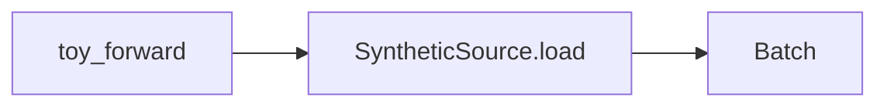
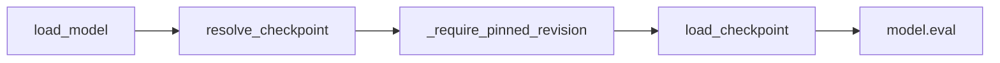

# aurora-inference

This repository contains a self-hosted inference service for the open-sourced Aurora model by Microsoft Research. The model was first released in June 2024, followed by its associated Nature article in October 2025. The links to official GitHub and Hugging Face repositories are found below.

[Aurora: A Foundation Model for the Earth System](https://github.com/microsoft/aurora)
[Hugging Face Repository for Aurora](https://huggingface.co/microsoft/aurora)

## Why this project

The project scope is a self-hosted engineering project based on an open-sourced foundation model, focusing on build towards a serving and inference optimisation layer. This is a deliberate bounded *initial* scope that emphasises core engineering skills whilst keeping costs low.

With growing concerns over data privacy, data governance and the overall sovereignty of AI systems, the benefits and ability to self-host one's AI model cannot be overstated. To that end, this project has two goals:

1. Self-hosting an open-sourced foundation model
    The checkpoints/weights of the trained Aurora foundation model are available on Hugging Face. The goal is to develop an end-to-end deep learning pipeline towards serving inference over an API.
2. Optimise for inference and understand trade-offs in performance
    Based on recent issues described on the official repository, there remains possible outstanding optimisations that can be performed on the model. The papers emphasise model architecture details and model fine-tuning whilst the official kit offer optimised options.
    Whilst such optimisation techniques are common across deep learning models, to the best of my knowledge, that there are no documented results on the trade-offs in Aurora's performance associated with these techniques.
    *i.e., how far can inference engineering be pushed before forecast quality suffers*. While learning to apply these techniques, I am to document these trade-offs in this repository.


At time of writing, the value of fine-tuning foundation models is acknowledged but such plans are reserved for the future.

## Current stage: Stage 0

Stage 0 involves building the scaffolding for the project.

Objectives include, but are not limited to the following:
1. Set up the repository with pre-commit hooks and Continuous Integration (CI) best practices
2. Locking dependencies using uv to enforce reproducibility
3. Define the contract for the model inputs and its associated tests
4. Create synthetic batches to run toy inferences on CPUs only
5. Create Docker files to build images and support runs on local and remote instances
6. Create Docker file that supports dual-architectures (linux/arm64 and linux/amd64)
7. Trial running the sequence of setup and tear down on a remote instance

## Quickstart

### Prerequisites

Ensure that Python version 3.12 and uv are installed.

The instructions here are for running a toy inference on a CPU.

All make commands are based on configurations specified in the `Makefile` in the project root.

Begin by cloning the repository and changing the working directory to the cloned project root.

```sh
git clone https://github.com/xerxeschongxian26/ms_aurora_portfolio.git
cd ms_aurora_portfolio
```

Run `make install` to install the required dependencies as specified in the `uv.lock` file.

```sh
make install
```

Next, run `make check` to run linters, typecheckers, the fast default pytest suite, and the ruff format check.

```sh
make check
```

Next, run `make test-slow` to run tests that are marked as slow. At the completion of Stage 0, these tests are still simple and usually quick once weights are cached; the first run may take much longer while Hugging Face downloads.

```sh
make test-slow
```

When the `make` commands above complete without error, the repository is deemed to be in a functional state.

To run the remaining commands in this section, ensure that Docker has been installed.

Run the commands below to build the Docker image from the `Dockerfile`. The commands assume a default `linux/arm64` architecture; a mismatch will return an `exec format error`.

The image does not bake in model checkpoints. Weights are cached on the host machine under `~/.cache/huggingface` and mounted into the container at run time (see the `docker-run` target in the `Makefile`).

The image building step takes approximately 10 minutes wall-time when running for the first time. Subsequent runs will take substantially less time as they are based on the cache of the Docker image.

```sh
make docker-build
make docker-run
```

If your host machine is based on an AMD/Intel architecture, use the following commands instead.

```sh
make docker-build PLATFORM=linux/amd64
make docker-run PLATFORM=linux/amd64
```

The following should be printed to the terminal as the result of an inference using a synthetic input `Batch`.
```
=== NO FORECAST SKILL === AuroraSmallPretrained + SyntheticSource is a plumbing proof only. Output is meaningless; do not report skill numbers.
input shapes: surf 2t=(1, 2, 32, 64) atmos t=(1, 2, 13, 32, 64) grid=32x64 device=cpu
model load wall time: 4.01s (includes HF cache hit or download)
forward wall time: 0.75s
output shapes: surf 2t=(1, 1, 32, 64) atmos t=(1, 1, 13, 32, 64) (T==1 as expected)
peak RSS: 1696.29 MiB (1778688000 bytes)
=== NO FORECAST SKILL ===
```

## Architecture

### Data Source Boundary



- **toy_forward** — Runs a toy forward pass on the CPU using AuroraSmallPretrained based on synthetic data
- **SyntheticSource** — A dataclass with the method `.load()` that generates a contractually correct `Batch` type input
- **Batch** — A dataclass shipped with the aurora library that stores the input features and which the model expects as an input

### Model Input Contract Validation


- **validate_input_times** — Runs inside every `BatchSource.load()`; checks t1 is exactly 6 hours ahead of t0
- **Batch** — The dataclass object being checked; configured contents must match `ModelSpec` / `AURORA_PRETRAINED_SPEC` before a forward pass is allowed
- **validate_batch** — Runs immediately before `model.forward()`; checks keys, shapes, coords, dtype/finite

### Model Checkpoint Loading



- **load_model** — Public entrypoint; orchestrates checkpoint resolution, pin enforcement, loading, and eval-mode setup
- **resolve_checkpoint** — Looks up `model_name` in `CHECKPOINT_REGISTRY`; resolves the HuggingFace repo, filename, and default revision
- **_require_pinned_revision** — Rejects `""`, `"main"`, `"master"`; the revision must be a pinned commit SHA (ADR 0003)
- **load_checkpoint** — Downloads the checkpoint from HuggingFace into a local cache and loads it into the model
- **model.eval** — Puts the model in eval mode and moves it to the target device before returning

## Roadmap

### Stage 0 — Foundations (Done)

Repo tooling and CI; locked deps with uv; Batch input contract + tests; synthetic batches for CPU toy inference; CPU Docker for local/remote; remote setup/teardown rehearsal via the GPU playbook. No connection to ERA5, no served API, no skill metrics.

### Stage 1 — Real ERA5 forecast pipeline - WIP

Build a reproducible pipeline ingesting ERA5 reanalysis into a weather foundation model to produce real global forecasts.

### Stage 2 — Measured baseline- WIP

Build an evaluation harness measuring forecast skill

### Stage 3 — Served & observable - WIP

Deploy the model as a monitored FastAPI inference service with latency/throughput/memory instrumentation

### Stage 4 — Optimized with a measured frontier - WIP

Optimise foundation-model inference

### Stage 5 — Depth, breadth & writeup - WIP

Write-up

## Personal Project Development Notes

### Background
Weather forecasting techniques have been in development since the early 1920s and the availability of compute resources and better modelling of the complex physics governing our Earth's system have improved the accuracy and size of the forecast window.

Modern weather forecasting techniques rely on classical numerical methods, solving the large systems of equations, one small increment at a time, repeated across various initial conditions, in order to arrive at a distribution of forecasts for the Earth system. This computationally expensive number crunching process is made possible only by the availablilty of supercomputing resources.

With the resurgence of deep neural networks and the explosion of computing resources, sufficiently trained deep learning models have made continued progress in demonstrating the ability to replace this computationally expensive step, driving down the cost of forecasting whilst improving forecasts. The Aurora weather foundation model by Microsoft Research is one of the latest in the line of AI weather forecasting models which include GenCast and GraphCast (Google DeepMind), Pangu-Weather (Huawei Cloud), FourCastNet (Nvidia), AIFS (European Centre for Medium-Range Weather Forecast), amongst others.

### Models, Architecture and Mathematical Logic
- The Aurora models appears to consists of smaller sub models for predicting air pollutions (particulate concentration), wave dynamics and of course, weather. Sub categories are also trained at different spacial resolutions
- The core architecture is a Swin Transformer and Perceiver
- The models are all pretrained and are available in a full and small version. The full version requires 40GB of memory, 5GB of which consists of the weights. This is approximately the capacity of an entry level enterprise GPU such as the NVIDIA RTX H100
- The smaller pretrained versions are provided for debugging purposes. It's input and output signatures (i.e. the shape of the heterogenous inputs and outputs) are identical to the full model but differ only in the complexity of the architectures, which consists of less layers and possibly a simpler architecture
- Input Time Step - t-1, and t
- Output time step - t + 1
- The input and output time steps resembles a 2nd order Markov property, despite classical numerical methods assuming a 1st order Markov
Property
### Data, Data Sources and Data Integrity
- Input data are heterogenous and unnormalised when fed into the network. Normalisation occurs inside the model
- The Batch and Metadata data classes are custom data classes that are part of the Aurora package
- Both the input and output are of the custom dataclass type Batch

### Ideas
- Demonstrate the ability to predict the cyclone path (and state?) for the recent Hurrican Melissa (Oct. 2025)

## License

MIT — see [LICENSE](LICENSE).
