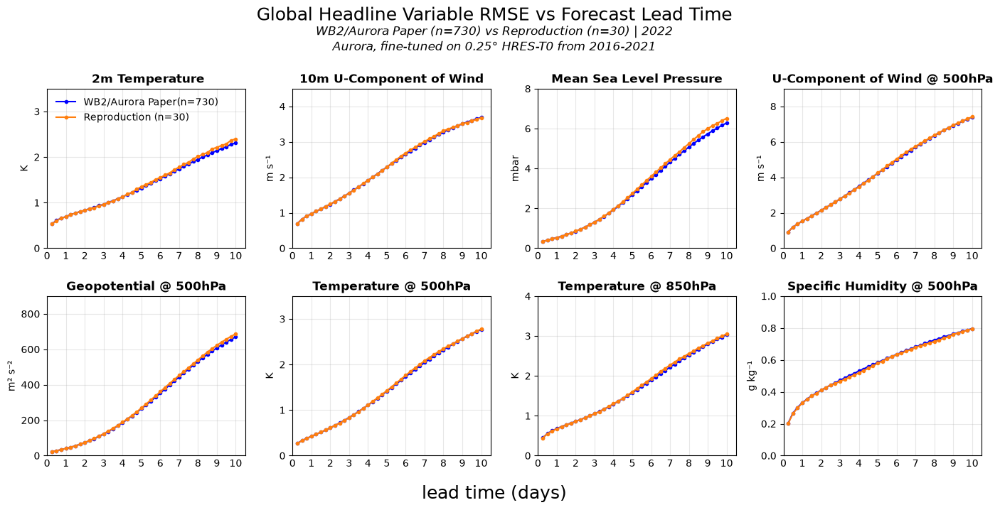

# How much precision does Aurora actually need?
_This is an independent study, not affiliated with or endorsed by Microsoft or the author's employer._

> **_Insert example key result here_**  
> e.g. bf16 autocast on a single A100-40GB: `[X]`× faster, `[Y]`% less peak VRAM, forecast RMSE within `[Z]`% of full precision to day 10.

This repository presents an independent study of mixed-precision inference for [Microsoft Aurora](https://github.com/microsoft/aurora) (0.25° fine-tuned checkpoint).  
To my knowledge, no published characterisation of this trade-off exists for Aurora.

<!-- EYE-CATTCHING - VISUALS 10-day rollout animation -->

  
   <em>10-day global 2m temperature forecast from <insert time here> initalisation point, produced by this pipeline.</em>

---

## Results

**Hardware:** Single NVIDIA A100-SXM4-40GB  
**Software:** Microsoft-Aurora `1.8.0` · PyTorch `2.12.1+cu130` · CUDA `runtime 13.0`

| Variant | What is cast | s / step | Peak VRAM (GiB) | Δ RMSE vs baseline, z500 | Δ RMSE vs baseline, t850 | Δ RMSE vs baseline, 2t | n |
|---|---|---|---|---|---|---|---|
| `fp32` (baseline) | matmul TF32 off (`highest`); cuDNN TF32 default-on | ~6.3 | ~27.1 | 0 (bitwise) | 0 (bitwise) | 0 (bitwise) | 6 |
| `tf32` | matmul + cuDNN | `[X]` | `[X]` | `[X]` | `[X]` | `[X]` | 30 |
| `bf16-autocast` | backbone only (encoder/decoder stay fp32) | `[X]` | `[X]` | `[X]` | `[X]` | `[X]` | 30 |

`fp32` s/step and peak VRAM are measured on this A100. Bitwise Δ RMSE is the **n=6** Q2 screen vs the headline archive (`6 × 40 × 8` = 1 920 zeros), not an n=30 confirm. `tf32` / `bf16-autocast` cells stay empty until Stage 3; their `n=30` is the planned confirm size.

### Key findings

- `[Finding 1]`
- `[Finding 2]`

### Figures

<_insert figure of overlapping RMSE plots of variants vs baseline_>

---

## Can we trust the baseline?

Before measuring precision trade-offs, the codebase was validated against the benchmark performance reported by [WeatherBench2](https://weatherbench2.readthedocs.io/) (Rasp et al., 2024).

### Matched Out-Sample Performance

  

<em>Headline RMSE vs lead time. WeatherBench2 Aurora vs HRES-T0 (n=730) overlaid with this pipeline’s Q1 skill run (n=30), 2022.</em>

- **8 headline variables** (z500, t850, 2t, 10u, msl, u500, t500, q500), n=30 inits from 2022 (held out from training), within 5% of the WB2 n=730 reference at all lead times up to and including day 10.

### Bitwise Reproducibility
- **Baseline floor (Q2 screen, n=6):** `fp32-baseline` vs the saved headline maps scored RMSE **0** on **1 920 / 1 920** rows (`6 × 40 × 8` headline slices). That is the Q2 wiring floor on this A100, not skill vs HRES-T0, and **not** an n=30 confirm of fp32 vs itself. Pairing uses persist `init_id` by `init_time` (spread ids 1, 6, 15, 16, 22, 24), not screen ordinal 1..6. Protocol: [`docs/benchmark-target.md`](docs/benchmark-target.md).

## Method

| | Detail |
|---|---|
| **Model** | `microsoft/aurora` 0.25° fine-tuned (`aurora-0.25-finetuned.ckpt` @ [`0be7e57`](https://huggingface.co/microsoft/aurora/commit/0be7e57)) |
| **Data** | WB2 HRES-T0 analysis, 2022 out-of-sample period, 00/12 UTC inits only. A hole is a store time with non-finite values; any window that touches [`configs/hres_t0_outsample_holes.csv`](configs/hres_t0_outsample_holes.csv) is skipped, not imputed. |
| **Metric** | Latitude-weighted RMSE (`cos(lat)` weights normalised to unit mean; WB2 / Aurora Supp. F, eq. F14) in `aurora_inference.evaluation.metrics.MSE`. No ACC. Runtime `src/` does not import `weatherbench2`. |
| **What is cast** | Stage 2 ships `fp32-baseline` only (`float32_matmul_precision="highest"`; `cudnn.allow_tf32` unset). `bf16-autocast` (`Aurora(autocast=True)`, backbone only) and `tf32` (`float32_matmul_precision="high"`) stay unmeasured until Stage 3. |
| **Hardware** | Single NVIDIA A100-SXM4-40GB, PyTorch `2.12.1+cu130`, CUDA `runtime 13.0` |
| **Init sets** | Q1 skill: n=30 year-spread ([`configs/hres_t0_2022_spread_rollout.toml`](configs/hres_t0_2022_spread_rollout.toml)). Q2 screen: n=6 ([`configs/hres_t0_2022_fidelity_screen_rollout.toml`](configs/hres_t0_2022_fidelity_screen_rollout.toml)). Public Q2 RMSE later requires the n=30 confirm. |

- Screen inits: one per named month (Jan / Apr / Jul / Oct) plus European heat-dome `2022-07-18T12` and Hurricane Ian `2022-09-27T00`.
- Timings: CUDA Events after a 3-step warm-up. Memory: `torch.cuda.max_memory_allocated` (~27.1 GiB allocated; ~37.6 GiB reserved).
- **GPU spend (Stage 2).** Two terminated A100-SXM4-40GB sessions: persist n=30 (`scripts/save_baseline_forecasts.py`, ~4.6 h) and Q2 screen n=6 (`scripts/run_fidelity.py`, ~0.64 h). Console $/hr was not recorded at booking. NFS still bills splice ~228 GiB + headline archive ~32 GiB at ~$0.20/GiB-month until those volumes are deleted.

---

## Limitations

- **n=30** for Q1 skill, not the supplementary information's full 730-init out-sample protocol
- Bitwise 1 920 is the **n=6** screen, not an n=30 fp32-vs-itself confirm
- Single GPU — A100-SXM4-40GB
- RMSE on _headline variables_ only — no ACC, no extreme-event metrics
- Deterministic model only (not Aurora 1.5 ENS)
---

## Roadmap

| Stage | Focus | Status |
|---|---|---|
| 0 | Environment, Docker, dependencies | ✅ Done |
| 1 | Forecast pipeline — end-to-end inference | ✅ Done |
| 2 | Evaluation harness — Q1 skill + Q2 fidelity wiring | ✅ Done |
| 3 | **Inference optimisation** — mixed precision, then batching only if peak VRAM drops; optional PTQ | 🔧 In progress |
| 4 | Report, figures, optional extended evaluation | 📝 Planned |
| 5 | **Inference serving** — one init in, forecast out | 📝 Planned |

Stage 3 is gated, not a checklist: (1) `tf32` and `bf16-autocast` vs the saved fp32 maps; (2) `B>1` **only if** mixed precision actually lowers peak VRAM on this A100 40GB (fp32 already OOMs at `B=2`); (3) hand-rolled post-training quantisation is an **appendix**, not a gate. Then Stage 4 write-up and Stage 5 serving with the cheapest variant that stayed inside the RMSE budget.

## Contributions to upstream

[PR #196](https://github.com/microsoft/aurora/pull/196): **Fix silent metadata–tensor shape mismatch in `Batch`** — merged into `microsoft/aurora`. Added post-init validation that catches mismatched time and pressure-level dimensions before they propagate silently through the model. Discovered via Issue [#188](https://github.com/microsoft/aurora/issues/188) during this work.

## Acknowledgements and Sources

**Aurora** (Bodnar et al., 2024)
- [Code](https://github.com/microsoft/aurora) · [Weights](https://huggingface.co/microsoft/aurora) · [Docs](https://microsoft.github.io/aurora/intro.html)
- [Paper](https://www.nature.com/articles/s41586-025-09005-y)
- [Supplementary Information](https://www.nature.com/articles/s41586-025-09005-y#Sec29)
- [Aurora 1.5, an update](https://www.microsoft.com/en-us/research/publication/aurora-1-5-fine-tuning-a-foundation-model-for-medium-range-ensemble-weather-prediction/)

**WeatherBench 2** (Rasp et al., 2024)
- [Paper](https://doi.org/10.1029/2023MS004019)
- [Docs](https://weatherbench2.readthedocs.io/)
- [Aurora vs HRES-T0, 2022](https://storage.googleapis.com/weatherbench2/benchmark_results/aurora_vs_hres_t0_1440x721_2022.nc)

Links last accessed 18 September 2026.

## License

MIT — see [LICENSE](LICENSE).

