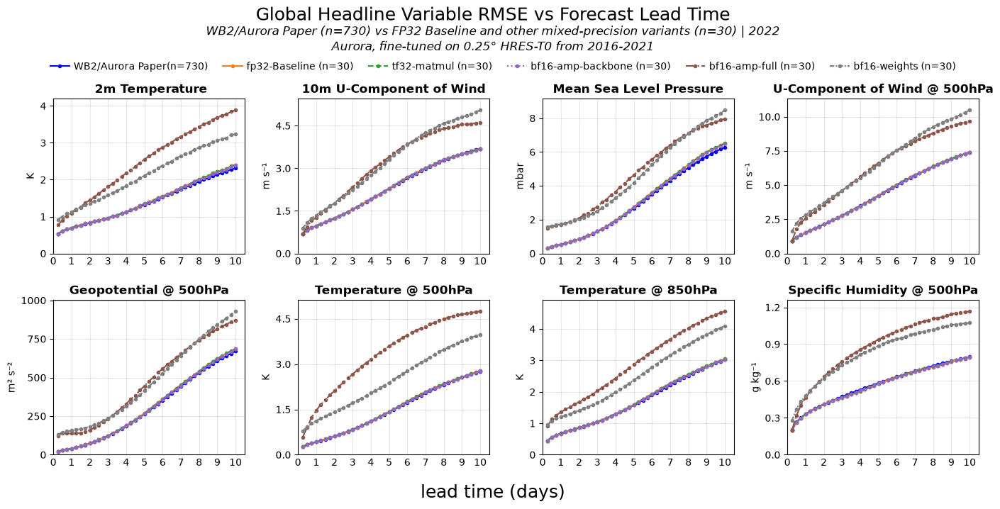

# Aurora - How much precision can you trade for speed?
_This is an independent study, not affiliated with or endorsed by Microsoft or the author's employer._

> On a single A100-SXM4-40GB, TF32 or backbone-only BF16 AMP is **3.0x** faster than `fp32-baseline` (2.0 vs 6.24 s/step) whilst providing similar fidelity, as measured by headline RMSE in a 40-step rollout.

This repository presents an independent study of mixed-precision inference for [Microsoft Aurora](https://github.com/microsoft/aurora) (0.25° fine-tuned checkpoint). To the best of my knowledge, no published characterisation of this trade-off exists for Aurora.

<!-- EYE-CATTCHING - VISUALS 10-day rollout animation -->

  
   <em>TF32 or backbone-only BF16 AMP matches baseline fidelity.</em>

---

## Results

### Inference Time and VRAM Usage
**Hardware:** Single NVIDIA A100-SXM4-40GB  
**Software:** Aurora `1.8.0` · PyTorch `2.12.1+cu130` · CUDA `runtime 13.0`  
**Evaluation:** 30 start dates × 40-step (10-day) autoregressive rollout

| Variant | s/step | 40-step | vs baseline | VRAM - Max Memory Allocated | VRAM - Max Memory Reserved |
|---|---:|---:|---:|---:|---:|
| `fp32-baseline` | 6.24 | 249.6 s | 1.0× | 27.11 GiB | 37.57 GiB |
| `tf32-matmul` | 2.05 | 82.1 s | 3.0× | 27.11 GiB | 37.57 GiB |
| `bf16-amp-backbone` | 2.09 | 83.5 s | 3.0× | 27.11 GiB | 36.02 GiB |
| `bf16-amp-full` | 1.37 | 54.8 s | 4.6× | 22.15 GiB | 31.18 GiB |
| `bf16-weights` | 1.11 | 44.2 s | 5.6× | 18.18 GiB | 22.26 GiB |

`-amp` keeps the downloaded 32-bit weights and uses 16-bit copies inside selected ops. `-weights` converts the stored weights themselves.

`fp16-weights` & `fp16-weights-amp` have no timings: mean sea-level pressure overflowed to infinity, and the run stops at the first non-finite value. 

### Variant Definition
| Variant | Definition |
|---|---|
| `fp32-baseline` | Nothing we set. Weights and matrix multiplies stay FP32. |
| `tf32-matmul` | Still 32-bit storage. Turns TF32 on for matrix multiplies via `float32_matmul_precision='high'`. Patch-embed conv TF32 was already on in `fp32-baseline`. |
| `bf16-amp-backbone` | Weights stay 32-bit. Only the backbone runs in BF16 via `Aurora(autocast=True)`. Encoder and decoder stay 32-bit. |
| `bf16-amp-full` | Weights stay 32-bit. The whole forward pass is wrapped in BF16 AMP via `torch.autocast`. |
| `bf16-weights` | Convert the stored weights to BF16 and run with those. No AMP. |
| `fp16-weights` | Convert the stored weights to FP16 via `model.half()`. Mean sea-level pressure overflows to infinity. |
| `fp16-weights-amp` | `model.half()`, then FP16 AMP on the forward pass. Mean sea-level pressure overflows to infinity. |

### Key Findings

- TF32 and backbone-only BF16 AMP are 3.0x faster for _similar_ VRAM usage
- BF16 for the entire model, including the weights, reduces fidelity in exchange for lower memory use and faster inference
- Casting FP16 introduces non-finite values as it only expresses values in the range of ±65,504

---

## Can we trust `fp32-baseline`?

Before measuring precision trade-offs, `fp32-baseline` was checked against [WeatherBench2](https://weatherbench2.readthedocs.io/) (Rasp et al., 2024).

### Matched Out-Sample Performance

  
   <em>`fp32-baseline` matches the benchmark fidelity.</em>

- **8 headline variables** (z500, t850, 2t, 10u, msl, u500, t500, q500), n=30 inits from 2022 (held out from training), within 5% of the WB2 n=730 reference at all lead times up to and including day 10.

## Method

| | Detail |
|---|---|
| **Model** | `microsoft/aurora` 0.25° fine-tuned (`aurora-0.25-finetuned.ckpt` @ [`0be7e57`](https://huggingface.co/microsoft/aurora/commit/0be7e57)) |
| **Data** | WB2 HRES-T0 analysis, 2022 out-of-sample period, 00/12 UTC inits only. |
| **Metric** | Latitude-weighted RMSE (`cos(lat)` weights normalised to unit mean; WB2 / Aurora Supp. F, eq. F14) in `aurora_inference.evaluation.metrics.MSE`. No ACC. Runtime `src/` does not import `weatherbench2`. |
| **What is cast** | `fp32-baseline`: `float32_matmul_precision="highest"` (matmul TF32 off; cuDNN TF32 remains the Ampere default on patch embed). `tf32-matmul`: `float32_matmul_precision="high"`. `bf16-amp-backbone`: `Aurora(autocast=True)` (backbone only). See the Results table for the rest. |
| **Hardware** | Single NVIDIA A100-SXM4-40GB, PyTorch `2.12.1+cu130`, CUDA `runtime 13.0` |

- Timings: CUDA Events after 3 warm-up forwards
---

## Limitations
- **n=30** not the paper's full 730-init out-sample
- Seconds/step include per-step CPU offload time; they are not kernel-only time
- Single GPU — A100-SXM4-40GB
- Fidelity measured using RMSE on _headline variables_ only — no ACC, no extreme-event metrics
- Deterministic model only. I have not attempted the same study on Aurora 1.5 ENS
---

## Roadmap

| Stage | Focus | Status |
|---|---|---|
| 0 | Environment, Docker, dependencies | ✅ Done |
| 1 | Forecast pipeline — end-to-end inference | ✅ Done |
| 2 | Evaluation harness — Q1 skill + Q2 fidelity wiring | ✅ Done |
| 3 | **Inference optimisation** — mixed precision, then batching only if peak VRAM drops; optional PTQ | 🔧 In progress |
| 4 | Report, figures, optional extended evaluation | 📝 Planned |
| 5 | **Inference serving** — one init in, forecast out | 📝 Planned |

## Contributions to upstream

[PR #196](https://github.com/microsoft/aurora/pull/196): **Fix silent metadata–tensor shape mismatch in `Batch`**  
- Added post-init validation that catches mismatched time and pressure-level dimensions before they propagate silently through the model. I discovered and raised Issue [#188](https://github.com/microsoft/aurora/issues/188) during work on this project.

## Acknowledgements and Sources

**Aurora** (Bodnar et al., 2024)
- [Code](https://github.com/microsoft/aurora) · [Weights](https://huggingface.co/microsoft/aurora) · [Docs](https://microsoft.github.io/aurora/intro.html)
- [Paper](https://www.nature.com/articles/s41586-025-09005-y)
- [Supplementary Information](https://www.nature.com/articles/s41586-025-09005-y#Sec29)
- [Aurora 1.5, an update](https://www.microsoft.com/en-us/research/publication/aurora-1-5-fine-tuning-a-foundation-model-for-medium-range-ensemble-weather-prediction/)

**WeatherBench 2** (Rasp et al., 2024)
- [Paper](https://doi.org/10.1029/2023MS004019)
- [Docs](https://weatherbench2.readthedocs.io/)
- [Aurora vs HRES-T0, 2022](https://storage.googleapis.com/weatherbench2/benchmark_results/aurora_vs_hres_t0_1440x721_2022.nc)

Links last accessed 18 September 2026.

## License

MIT — see [LICENSE](LICENSE).

