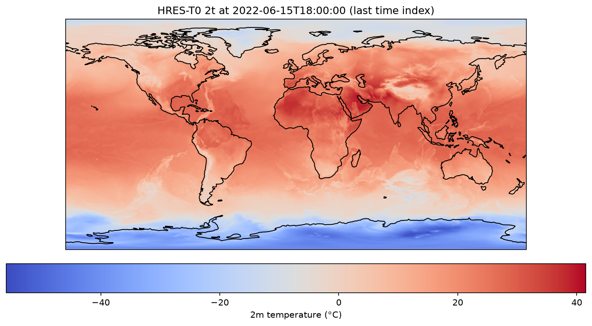
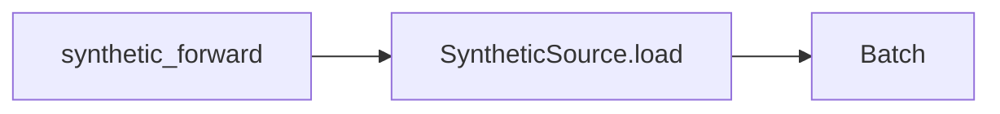
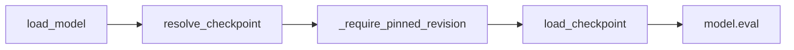

# Project Name: aurora-inference

<p align="center">
  
</p>

*2 m temperature from Aurora fine-tuned on HRES-T0. Init 2022-06-15T12.  
Forecast maps and numbers in this repo are from this project’s pipeline, not Microsoft or the Aurora authors, unless a figure is cited from the paper.*  

This repository contains a self-hosted inference service for the open-sourced Aurora model by Microsoft Research. The model was first released in June 2024, followed by its associated Nature article in October 2025. The links to official GitHub, Hugging Face repositories, and follow-up paper, are found below.

[Aurora: A Foundation Model for the Earth System](https://github.com/microsoft/aurora)  
[Hugging Face Repository for Aurora](https://huggingface.co/microsoft/aurora)  
[Aurora 1.5, follow-up paper](https://www.microsoft.com/en-us/research/publication/aurora-1-5-fine-tuning-a-foundation-model-for-medium-range-ensemble-weather-prediction/)

## Why this project

The project scope is a self-hosted engineering project based on an open-sourced foundation model, focusing on building towards a serving and inference optimisation layer. This is a deliberate bounded scope that emphasises core ML engineering skills whilst keeping costs low.

With growing concerns over data privacy, data governance and the overall sovereignty of AI systems, the benefits and ability to self-host one's AI model cannot be overstated. To that end, this project has three goals:

1. Self-hosting an open-sourced foundation model
    The checkpoints/weights of the trained foundation model are available on Hugging Face. The goal is to develop an end-to-end deep learning pipeline towards serving inference over an API.
2. Optimise for inference and understand trade-offs in performance
    Based on recent issues described on the official repository, there remains possible outstanding optimisations that can be performed on the model. The papers emphasise model architecture details and model fine-tuning whilst the official kit offer optimised options.
    Whilst such optimisation techniques are common across deep learning models, to the best of my knowledge, there are no documented results on the trade-offs in Aurora's performance associated with these techniques.
    *i.e., how far can inference engineering be pushed before forecast quality suffers*. While learning to apply these techniques, I aim to document these trade-offs in this repository.
3. Whilst fine-tuning models is an important step in the development and deployment of deep learning models, I have deliberately chosen to exclude fine-tuning from this project to keep costs low and feedback loops short.

## Current stage: Stage 1

Stage 1 involves building a reproducible pipeline that ingests HRES_T0 analysis data into a weather foundation model to produce real out-of-sample global forecasts.

Objectives included, but are not limited to the following:
1. Identify a reported performance metric from the papers
2. Create a data seam for the HRES_T0 data source from the WeatherBench2 benchmark Google Cloud Storage, called HresTOSource
3. Create a data seam for the associated static variables (lat-lon coordinates .etc) stored in the HuggingFace repository
4. Create a script to perform a toy single forecast (single-step inference) on a CPU
  - Uses a trimmed feature set
5. Create a script to perform a toy rollout forecast (autoregressive inference) on a CPU
  - Uses a trimmed feature set
6. Create a script to perform a real rollout forecast (autoregressive inference) on a GPU
  - Uses a full feature set
7. Create the GPU stage for the Dockerfile to run a real rollout forecast
8. Complete a full setup-inference-teardown cycle 
9. Write associate integration and unit tests for the above

## Quickstart

### Prerequisites

Python 3.12 and [uv](https://docs.astral.sh/uv/) are required for the quality gate. The Stage 1 forecast map is produced on a GPU: Docker with NVIDIA Container Toolkit (`--gpus all`), or a host with CUDA and `uv sync --extra forecast`.

Make targets are defined in the `Makefile`. The default `PLATFORM` is `linux/arm64` (Apple Silicon / GH200). On x86_64 cloud GPUs (A10 / A100 / H100) pass `PLATFORM=linux/amd64` or the image will fail with `exec format error`.

### Clone and quality gate

```sh
git clone https://github.com/xerxeschongxian26/ms_aurora_portfolio.git
cd ms_aurora_portfolio
make install
make check
make test-slow
```

`make install` syncs the lockfile with the `dev` extra. `make check` runs Ruff, mypy, the fast pytest suite (fixtures only, no network), and a format check. `make test-slow` loads the pinned small checkpoint from Hugging Face (first run downloads into `~/.cache/huggingface`).

### GPU forecast (HRES-T0 → Aurora 0.25° FT)

This is the Stage 1 entrypoint: `scripts/real_forecast.py` loads WB2 HRES-T0, runs `run_rollout` on `aurora-finetuned`, and writes one global `2t` PNG per step. Init time is `2022-06-15T12`. The script exits if CUDA is unavailable.

The GPU image does not bake in checkpoints. Hugging Face weights are cached on the host and mounted at run time. The run needs network for the public HRES-T0 zarr on GCS and, on a cache miss, the fine-tuned checkpoint.

```sh
make docker-build-gpu PLATFORM=linux/amd64
mkdir -p outputs
docker run --gpus all \
  -e HF_HOME=/cache/huggingface \
  -v "$HOME/.cache/huggingface:/cache/huggingface" \
  -v "$(pwd)/outputs:/app/outputs" \
  --rm \
  --platform linux/amd64 \
  aurora-inference:gpu-linux-amd64
```

`make docker-run-gpu PLATFORM=linux/amd64` is the same run **without** an outputs mount. The Makefile uses `--rm`, so maps written under `/app/outputs` are deleted with the container unless you bind-mount `outputs/` as above.

On success the logs include a forecast-skill banner and rollout wall time. PNGs land in `outputs/real_forecast_2t_stepNN.png` (gitignored). The banner image in this README is one of those maps.

Without Docker, on a CUDA host:

```sh
uv sync --extra forecast --frozen
python scripts/real_forecast.py --steps 4
```

### CPU plumbing (optional)

The CPU image runs `scripts/synthetic_forward.py`: `AuroraSmallPretrained` on a synthetic 32×64 batch. Output has no forecast skill.

```sh
make docker-build PLATFORM=linux/amd64
make docker-run PLATFORM=linux/amd64
```

Omit `PLATFORM=...` on `linux/arm64` hosts. Expect a `NO FORECAST SKILL` banner and shape / timing lines on stdout; this path does not write PNGs.

## Architecture

### Data Source Boundary



- **synthetic_forward** — Runs a CPU forward pass using AuroraSmallPretrained on synthetic data (no forecast skill)
- **SyntheticSource** — A dataclass with the method `.load()` that generates a contractually correct `Batch` type input
- **Batch** — A dataclass shipped with the aurora library that stores the input features and which the model expects as an input

### Model Input Contract Validation


- **validate_input_times** — Runs inside every `BatchSource.load()`; checks t1 is exactly 6 hours ahead of t0
- **Batch** — The dataclass object being checked; configured contents must match `ModelSpec` / `AURORA_PRETRAINED_SPEC` before a forward pass is allowed
- **validate_batch** — Runs immediately before `model.forward()`; checks keys, shapes, coords, dtype/finite

### Model Checkpoint Loading



- **load_model** — Public entrypoint; orchestrates checkpoint resolution, pin enforcement, loading, and eval-mode setup
- **resolve_checkpoint** — Looks up `model_name` in `CHECKPOINT_REGISTRY`; resolves the HuggingFace repo, filename, and default revision
- **_require_pinned_revision** — Rejects `""`, `"main"`, `"master"`; the revision must be a pinned commit SHA (ADR 0003)
- **load_checkpoint** — Downloads the checkpoint from HuggingFace into a local cache and loads it into the model
- **model.eval** — Puts the model in eval mode and moves it to the target device before returning

## Roadmap

### Stage 0 — Scaffolding and Foundations

Stage 0 involves building the scaffolding for the project.

Repo tooling and CI; locked deps with uv; Batch input contract + tests; synthetic batches for CPU toy inference; CPU Docker for local/remote; remote setup/teardown rehearsal via the GPU playbook. No connection to ERA5, no served API, no skill metrics.

Objectives included, but are not limited to the following:
1. Set up the repository with pre-commit hooks and Continuous Integration (CI) best practices
2. Locking dependencies using uv, a modern package manager, to enforce reproducibility
3. Define the contract for the model inputs and its associated tests
4. Create synthetic batches to run toy inferences on CPUs only
5. Create Docker files to build images and support runs on local and remote instances
6. Create Docker file that supports dual-architectures (linux/arm64 and linux/amd64)
7. Trial running the sequence of setup and tear down on a remote instance

### Stage 1 — Real forecast pipeline - WIP

Stage 1 involves building a reproducible pipeline that ingests HRES_T0 analysis data into a weather foundation model to produce real out-of-sample global forecasts.

Objectives included, but are not limited to the following:
1. Identify a reported performance metric from the papers
2. Create a data seam for the HRES_T0 data source from the WeatherBench2 benchmark Google Cloud Storage, called HresTOSource
3. Create a data seam for the associated static variables (lat-lon coordinates .etc) stored in the HuggingFace repository
4. Create a script to perform a toy single forecast (single-step inference) on a CPU
  - Uses a synthetic feature set
5. Create a script to perform a toy rollout forecast (autoregressive inference) on a CPU
  - Uses a trimmed feature set
6. Create a script to perform a real rollout forecast (autoregressive inference) on a GPU
  - Uses a full feature set
7. Create the GPU stage for the Dockerfile to run a real rollout forecast
8. Complete a full setup-inference-teardown cycle 
9. Write associate integration and unit tests for the above

### Stage 2 — Measured baseline - Upcoming

Build an evaluation harness measuring, establishing and confirming a baseline skill for the model

### Stage 3 — Served & observable - Upcoming

Deploy the model as a monitored FastAPI inference service with latency/throughput/memory instrumentation

### Stage 4 — Optimized with a measured frontier - Upcoming

Optimise foundation-model inference

### Stage 5 — Depth, breadth & writeup - Upcoming

Write-up

## Personal Project Development Notes

### Background
Weather forecasting techniques have been in development since the early 1920s and the availability of compute resources and better modelling of the complex physics governing our Earth's system have improved the accuracy and size of the forecast window.

Modern weather forecasting techniques rely on classical numerical methods, solving the large systems of equations, one small increment at a time, repeated across various initial conditions, in order to arrive at a distribution of forecasts for the Earth system. This computationally expensive number crunching process is made possible only by the availablilty of supercomputing resources.

With the resurgence of deep neural networks and the explosion of computing resources, sufficiently trained deep learning models have made continued progress in demonstrating the ability to replace this computationally expensive step, driving down the cost of forecasting whilst improving forecasts. The Aurora weather foundation model by Microsoft Research is one of the latest in the line of AI weather forecasting models which include GenCast and GraphCast (Google DeepMind), Pangu-Weather (Huawei Cloud), FourCastNet (Nvidia), AIFS (European Centre for Medium-Range Weather Forecast), amongst others.

### Models, Architecture and Mathematical Logic
- The Aurora models appears to consists of smaller sub models for predicting air pollutions (particulate concentration), wave dynamics and of course, weather. Sub categories are also trained at different spacial resolutions
- The core architecture is a Swin Transformer and Perceiver
- The models are all pretrained and are available in a full and small version. The full version requires 40GB of memory, 5GB of which consists of the weights. This is approximately the capacity of an entry level enterprise GPU such as the NVIDIA RTX H100
- The smaller pretrained versions are provided for debugging purposes. It's input and output signatures (i.e. the shape of the heterogenous inputs and outputs) are identical to the full model but differ only in the complexity of the architectures, which consists of less layers and possibly a simpler architecture
- Input Time Step - t-1, and t
- Output time step - t + 1
- The input and output time steps resembles a 2nd order Markov property, despite classical numerical methods assuming a 1st order Markov
Property
### Data, Data Sources and Data Integrity
- Input data are heterogenous and unnormalised when fed into the network. Normalisation occurs inside the model
- The Batch and Metadata data classes are custom data classes that are part of the Aurora package
- Both the input and output are of the custom dataclass type Batch

### Ideas
- Demonstrate the ability to predict the cyclone path (and state?) for the recent Hurricane Melissa (Oct. 2025)

## License

MIT — see [LICENSE](LICENSE).
