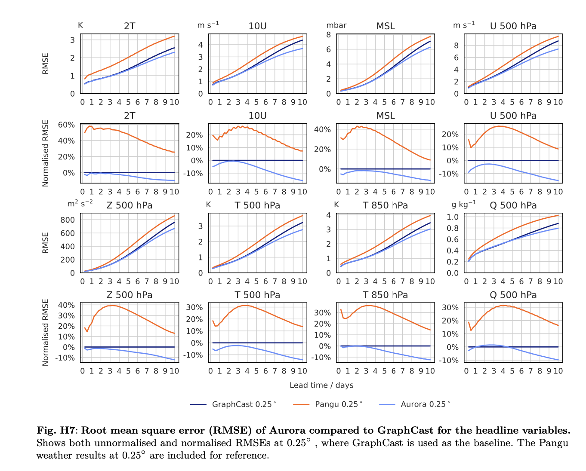
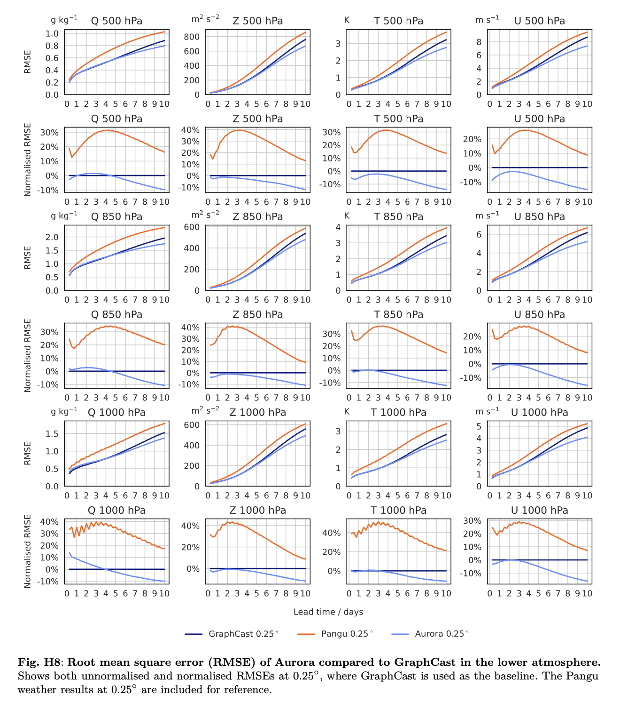
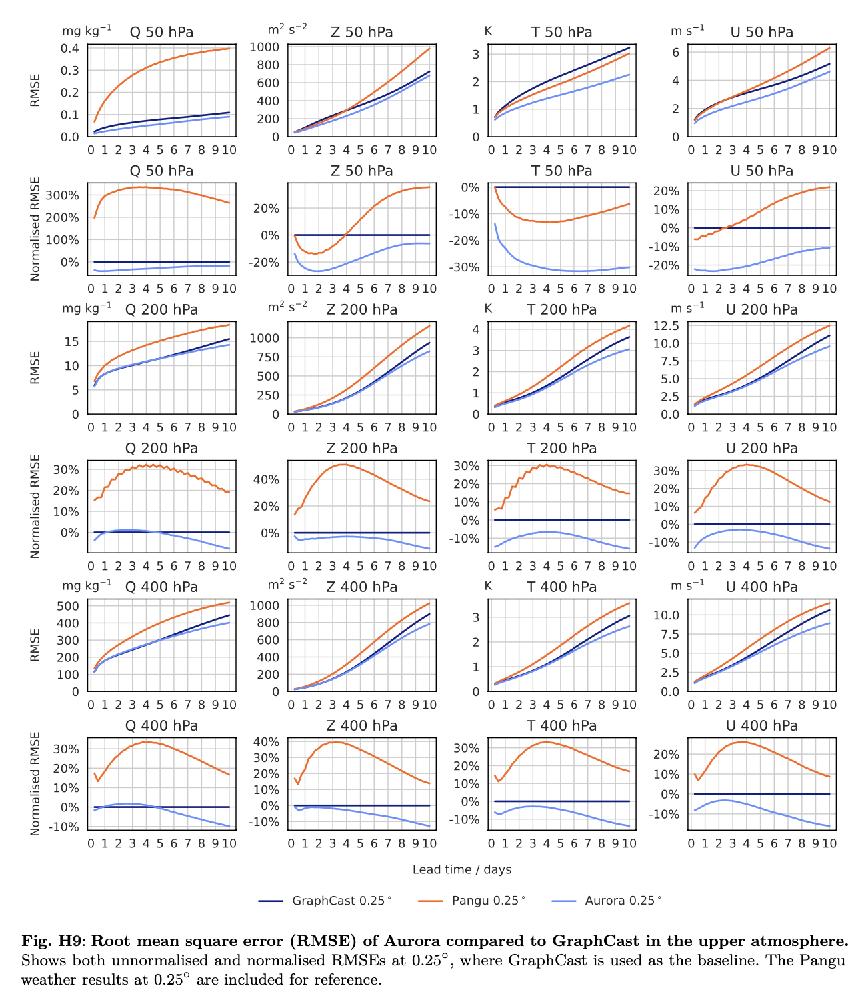

# Benchmark target — Q1 skill gate (Stage 2)

The benchmark targets are found in section H of the Supplementary Information released with the original Aurora paper.
They are the figures H7, H8 and H9, corresponding to the absolute RMSE of various predicted variables in the lower and upper atmosphere, over a different lead times up to 10 days.

## 1. Target curves

Below are the three benchmark target figures referenced from the Aurora paper (section H):

  

The term headline variables is borrowed from the WeatherBench2 terminology, which are specific variables classified by the European Centre for Medium-Range Weather Forecasts (ECMWF) as being adequate summaries for the quality of medium-range forecasts.

  

  

## 2. Eval protocol

- Test year: 2022
- Initialisation points: Every 00UTC and 12UTC
- Lead times: 1 to 10 days
- Evaluation metrics: Re-use evaluation metrics by WeatherBench2

## 3. Pass criterion

- 5% tolerance threshold for reproducing the results

## References

- [`docs/hres-t0-source-notes.md`](hres-t0-source-notes.md)
- [`.cursor/plans/stage1_forecastpipeline.md`](../.cursor/plans/stage1_forecastpipeline.md)
